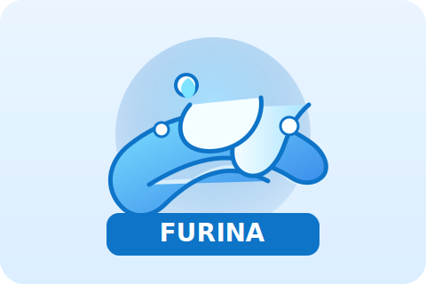

# Packice

A clean, geometric mark inspired by frozen hexagons and modular packages. The layered crystal cube highlights caching depth, while the smaller floating shard hints at peer-to-peer distribution.

## Logo usage
- Primary file: `docs/assets/packice-logo.svg`.
- Keep at least 24px padding around the mark and wordmark when placing it in layouts.
- For dark backgrounds, the default SVG works as-is; on very light backgrounds, consider adding a subtle outer shadow or placing the logo on a light blue chip.
- The logo scales cleanly for README badges, docs cover images, or splash screens.

## Furina logo

A flowing crest inspired by fountains and tidal curves. Soft gradients wrap a circular halo, while layered waves and droplets celebrate motion and waterborne energy.

### Usage notes
- Primary file: `docs/assets/furina-logo.svg`.
- Works on light backgrounds; add a faint outer shadow if placing on pure white.
- Keep a minimum 24px margin around the emblem and wordmark when used together.
